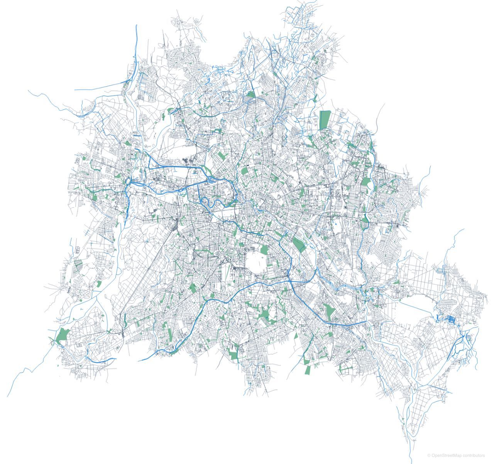

# osmflat



Flat OpenStreetMap (OSM) data format with very efficient *random* access
pattern through [memory mapped files].

The data format is described and implemented in [flatdata]. The [schema]
describes the fundamental OSM data structures as nodes, ways, relations and
tags as simple non-nested data structures. The relations between them are
expressed through indexes.

## Compiler

Besides the library for working with osmflat archives, this crate contains an
OSM [pbf format][PBF format] to osmflat data compiler.

To compile OSM data from pbf to osmflat use:

```shell
cargo run osmflatc -- input.osm.pbf output.osm.flatdata
```

The output is a flatdata archive, which is a directory consisting of several
files. The schema is also part of the archive. It checked every an archive is
opened for changes. This guarantees that an archive is produced by the same
software as we use for opening it. The archive data is not compressed.

## Using data

First, add this to your Cargo.toml:

```toml
[dependencies]
flatdata = "0.1.3"
osmflat = "0.1.0"
```

Now, you can open an osmflat archive as any other flatdata archive and read its
data:

```rust
extern crate flatdata;
extern crate osmflat;

use flatdata::{Archive, FileResourceStorage};
use std::rc::Rc;
use std::cell::RefCell;

fn main() -> Result<(), Error> {
    let storage = Rc::new(RefCell::new(FileResourceStorage::new(
        "path/to/archive.osm.flatdata".into()
    )));
    let archive = osmflat::Osm::open(storage)?;

    for node in archive.nodes().iter() {
        println!("{:?}", node);
    }

    Ok(())
}
```

Cf. the [examples] directory for more examples. Feel free to add another
example, if you have an idea what to with the amazing OSM data in few lines of
code. 😁

The above map was rendered by `examples/render` in 230 loc from the osmflat
archive based on the [latest][latest-berlin-map] Berlin OSM data.

## License

 * Apache License, Version 2.0, ([LICENSE-APACHE](LICENSE-APACHE) or
   http://www.apache.org/licenses/LICENSE-2.0)
 * MIT License ([LICENSE-MIT](LICENSE-MIT) or
   http://opensource.org/licenses/MIT)

### Contribution

Unless you explicitly state otherwise, any contribution intentionally submitted
for inclusion in this document by you, as defined in the Apache-2.0 license,
shall be dual licensed as above, without any additional terms or conditions.

[flatdata]: https://github.com/heremaps/flatdata
[schema]: src/flatdata/osm.flatdata
[memory mapped files]: https://en.wikipedia.org/wiki/Memory-mapped_file
[PBF format]: https://wiki.openstreetmap.org/wiki/PBF_Format
[examples]: examples
[latest-berlin-map]: http://download.geofabrik.de/europe/germany/berlin.html
