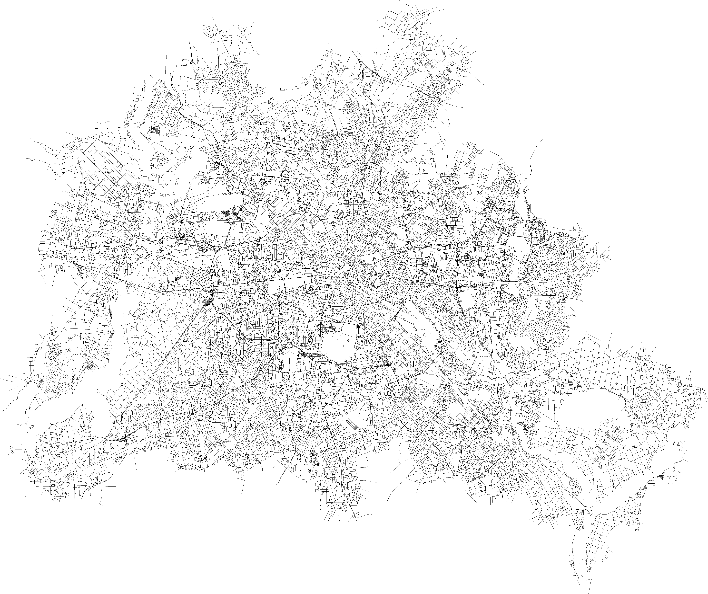

# Examples

This a collection of examples showing how to use the `osmflat` library.
Some of the examples were ported from the `libosmium`'s
[examples directory].

The source code in this directory is under public domain, and can be freely
copied and modified.

## Getting started

* `read` - reads the contents of the input archive.
* `count` - counts the number of nodes, ways, and relations in the input archive.
* `dump` - dumps the contents of the input archive in a debug format.

## Simple

* `pub-names` - shows the names and addresses of all pubs.
* `road-length` - calculates the length of the road network in the input archive.

## Rendering

* `render-roads` - renders all roads by using a simple Bresenham line algorithm as PNG.
  

    
  

* `render-features` - renders selected features from the input archive as SVG.
  

    
  

[examples directory]: https://github.com/osmcode/libosmium/tree/master/examples
